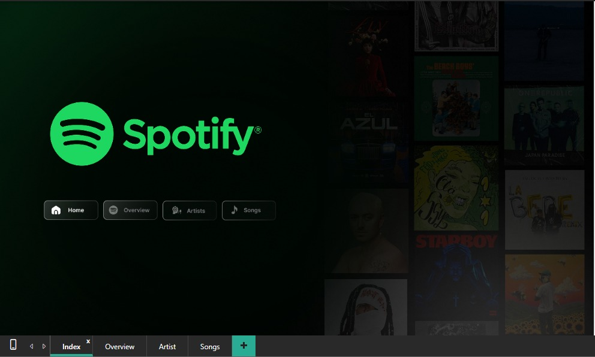
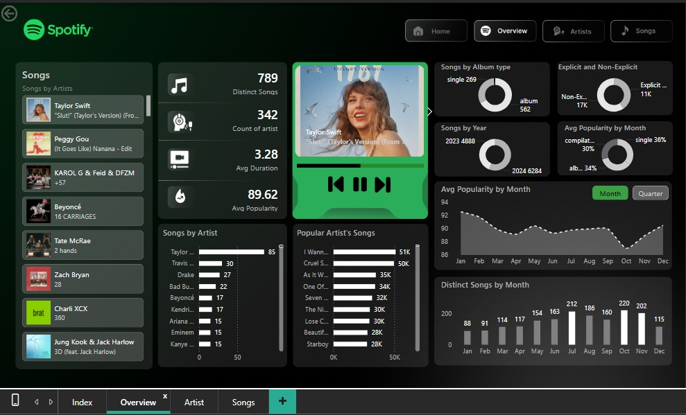
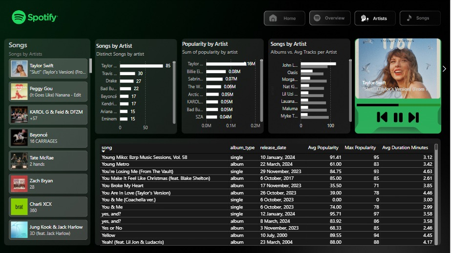
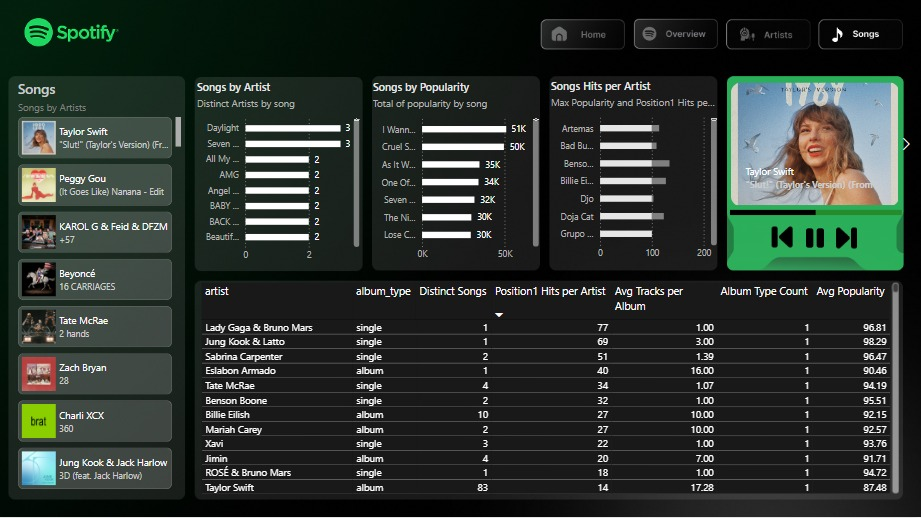

# 🎧 Spotify Dashboard — Power BI

A focused, insight-driven dashboard built in Power BI to explore Spotify music trends, popular artists, and track performance.

The goal: turn raw music data into something visual, meaningful, and easy to understand.

---

## 🖼 Dashboard Preview

> Clean visuals. Centered. Easy on the eyes.

### 📌 Overview Page

  

### 🎙 Top Artists & Tracks

  

### 📈 Popularity & Streams

  

### 🎼 Track Details & Attributes

  

---

## 🎯 What This Dashboard Shows

- Top-performing songs and artists  
- Popularity vs streams comparison  
- Track rankings and performance highlights  
- Duration and listening behavior insights  

Every visual is designed to answer simple questions fast — without overloading the viewer.

---

## 🛠 Tools & Skills

| Tool / Concept | Use |
|----------------|-----|
| Power BI | Dashboard building |
| Power Query | Data cleaning |
| DAX | Basic calculations |
| CSV Dataset | Spotify Top 50 |
| Design Assets | Icons & backgrounds |

---

## 📂 Repo Contents

- `Spotify.pbix` — main dashboard  
- `spotify-top-50-world.csv` — dataset  
- `Business_Requirements.docx` — project brief  
- `Spotify_Preview_Video.mp4` — small walkthrough  
- `Spotify_Dashboard_images/` — screenshots  

---

## 🚀 How To View

1️⃣ Download the `.pbix` file  
2️⃣ Open using **Power BI Desktop**  
3️⃣ Explore visuals, filters, and insights

---

## 🔍 Key Insights

- Popularity doesn’t always equal highest streams  
- A few artists repeatedly dominate  
- Shorter tracks often perform better  
- Engagement is driven by a small number of hits  

(Adjust if your observations differ.)

---

## 🔮 Future Improvements

- More advanced DAX analysis  
- Time-series trends  
- Live data connection (Spotify API)  
- Automated refresh pipeline  

---

### 🙌 About This Project

Built as part of my data analytics journey — focusing on storytelling, dashboard design, and clarity.

If you find this helpful, feel free to ⭐ the repo!

